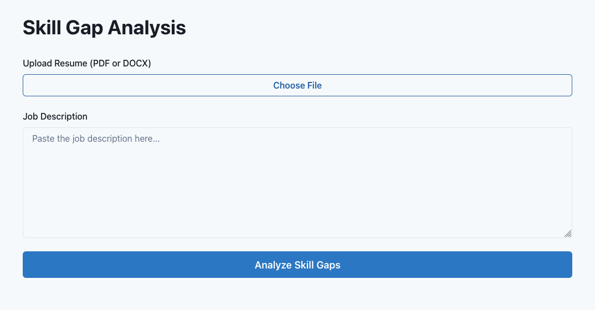
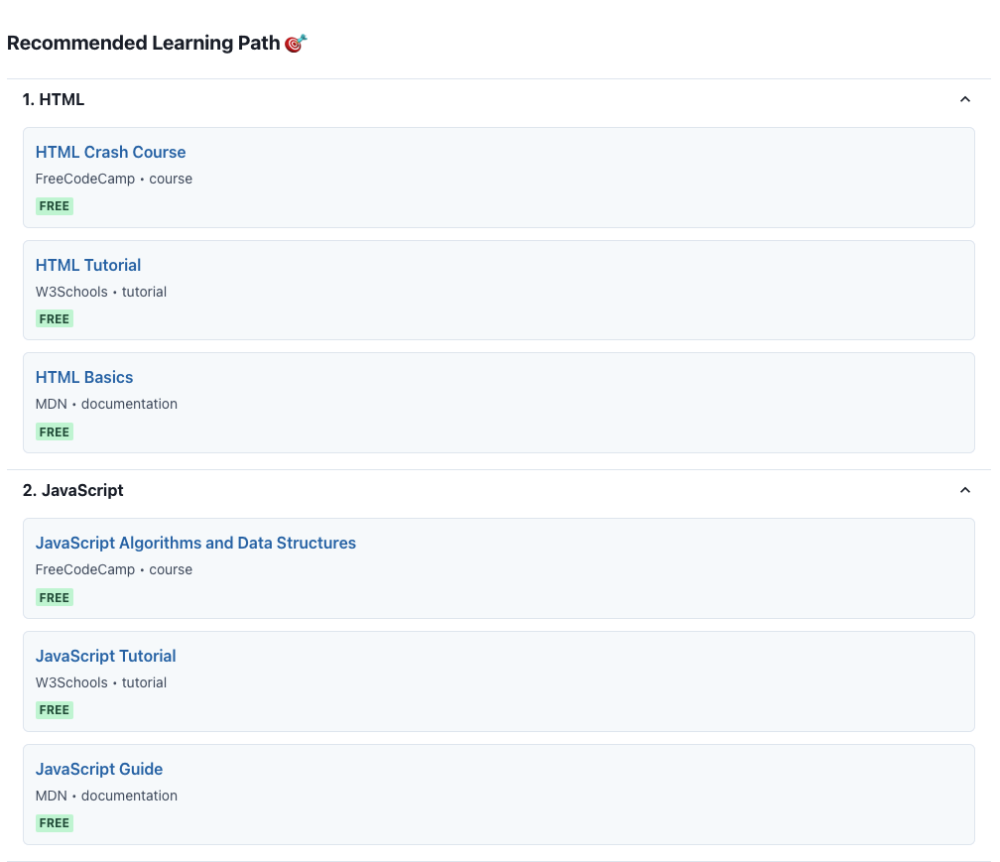

# Kadirin - AI-Powered Skill Gap Analyzer

Transform your career transition with AI-powered skill gap analysis. Upload your resume and a job description to get personalized learning recommendations.


## 🚀 Features

- **Instant Analysis**: Upload your resume (PDF/DOCX) and get immediate feedback
- **AI-Powered Insights**: Uses Claude AI to identify skill gaps accurately
- **Personalized Learning Paths**: Get curated free resources for each skill
- **Priority System**: See which skills are critical, important, or nice-to-have
- **Time Estimates**: Know exactly how long it will take to bridge each gap
- **Free to Use**: No signup required, completely free

## 📸 Screenshots

### Home Page


### Analysis Interface



### Skill Gap Results


### Learning Roadmap


### Learning Resources



## 🛠️ Tech Stack

- **Frontend**: Next.js 15, React 19, Chakra UI
- **AI**: Anthropic Claude Sonnet 4
- **File Processing**: pdf2json, mammoth
- **Deployment**: Docker, Docker Compose

## 🏃 Quick Start

### Prerequisites

- Node.js 20+
- Docker (optional)
- Anthropic API Key

### Local Development

```bash
# Clone the repository
git clone https://github.com/yourusername/kadirin.git
cd kadirin

# Install dependencies
npm install --legacy-peer-deps

# Set up environment variables
cp .env.example .env.local
# Add your ANTHROPIC_API_KEY to .env.local

# Run development server
npm run dev
```

Open [http://localhost:3000](http://localhost:3000)

### Docker Deployment

```bash
# Build the image
docker build -t kadirin:latest .

# Run with Docker Compose
docker compose up -d

# View logs
docker compose logs -f

# Stop
docker compose down
```

## 🔑 API Key Setup

1. Go to [https://console.anthropic.com](https://console.anthropic.com)
2. Sign up for a free account ($5 credit included)
3. Create an API key
4. Add to `.env.local`:

```
   ANTHROPIC_API_KEY=sk-ant-your-key-here
```

## 📁 Project Structure

```
kadirin/
├── app/
│   ├── page.tsx              # Landing page
│   ├── layout.tsx            # Root layout
│   ├── analyze/
│   │   └── page.tsx          # Analysis interface
│   └── api/
│       └── analyze/
│           └── route.ts      # API endpoint
├── components/
│   ├── ResumeUpload.tsx      # File upload component
│   ├── JobInput.tsx          # Job description input
│   ├── SkillGapResults.tsx   # Results display
│   └── LearningRoadmap.tsx   # Learning path
├── lib/
│   ├── providers.tsx         # Chakra UI provider
│   ├── claude.ts             # Claude API integration
│   └── parsers.ts            # Resume parsing
├── types/
│   └── index.ts              # TypeScript types
├── Dockerfile
├── docker-compose.yml
└── package.json
```

## 🎯 How It Works

1. **Upload Resume**: Supports PDF and DOCX formats
2. **Paste Job Description**: Copy from LinkedIn, Indeed, or any job board
3. **AI Analysis**: Claude analyzes your skills vs. job requirements
4. **Get Results**:
   - Existing skills you already have
   - Skills you need to develop (with priority levels)
   - Estimated learning time for each skill
   - Curated free learning resources
   - Recommended learning path

## 🚢 Deployment

### Vercel

```bash
# Install Vercel CLI
npm i -g vercel

# Deploy
vercel
```

### DigitalOcean

- Use App Platform
- Connect GitHub repo
- Add `ANTHROPIC_API_KEY` environment variable
- Deploy

## 🤝 Contributing

Contributions are welcome! Please feel free to submit a Pull Request.

1. Fork the repository
2. Create your feature branch (`git checkout -b feature/AmazingFeature`)
3. Commit your changes (`git commit -m 'Add some AmazingFeature'`)
4. Push to the branch (`git push origin feature/AmazingFeature`)
5. Open a Pull Request

## 📝 License

This project is licensed under the MIT License - see the [LICENSE](LICENSE) file for details.

## 🙏 Acknowledgments

- Built with [Next.js](https://nextjs.org/)
- Powered by [Anthropic Claude](https://www.anthropic.com/)
- UI components from [Chakra UI](https://chakra-ui.com/)

## 📧 Contact

Project Link: [https://github.com/yourusername/kadirin](https://github.com/amusse7/kadirin)

---

Created by Abdulkadir Musse
